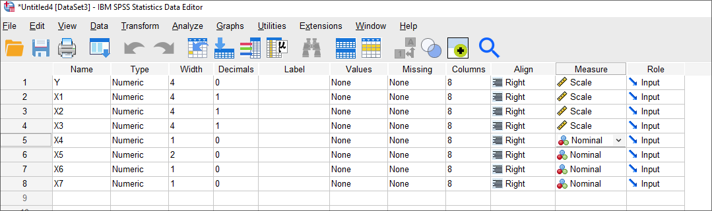
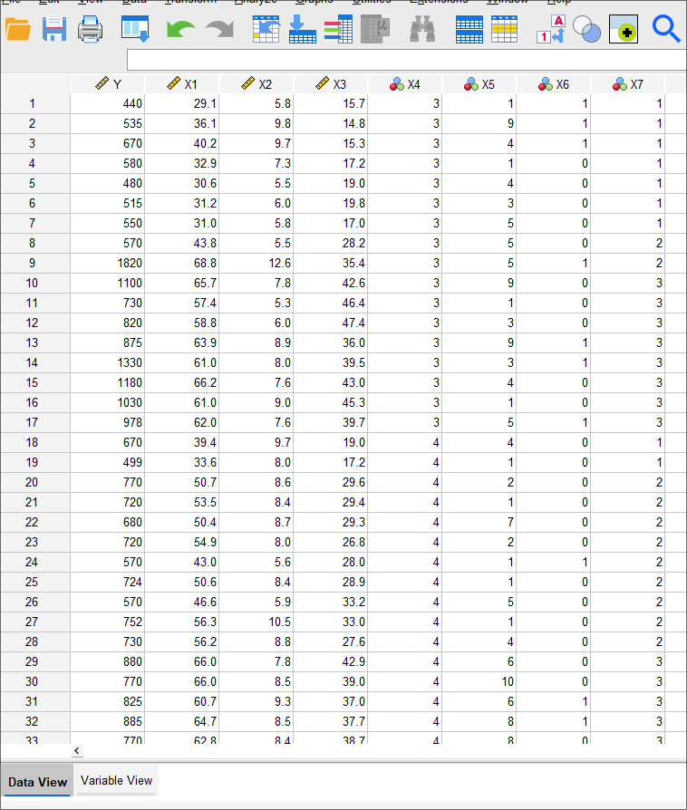
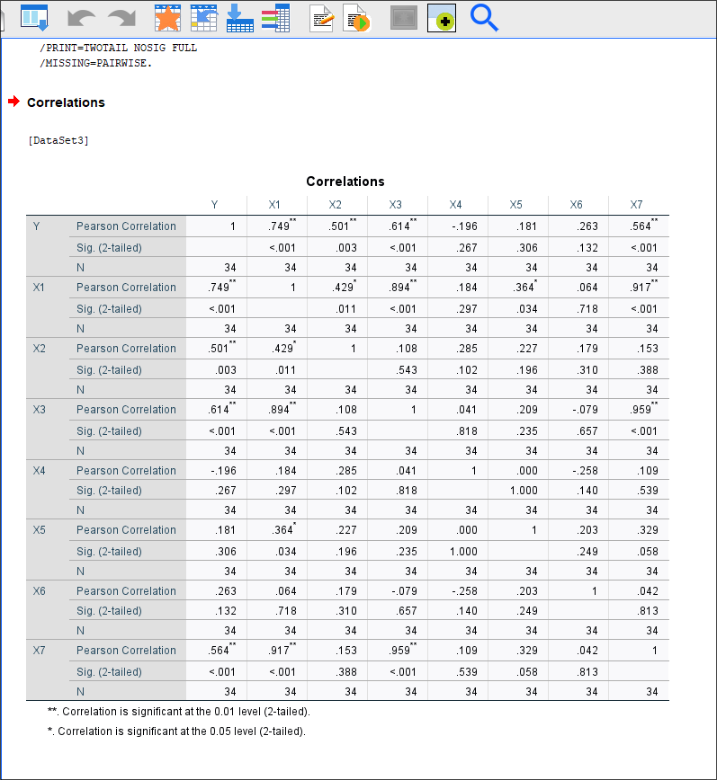
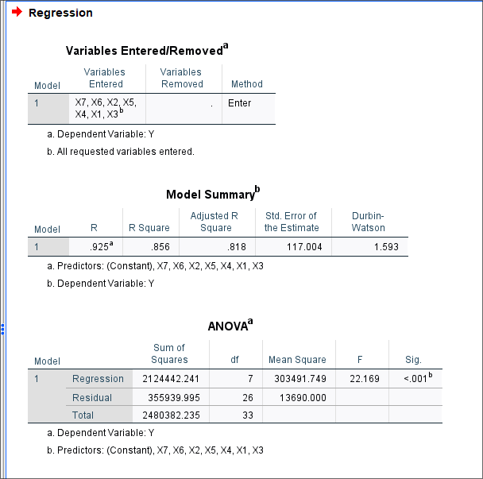
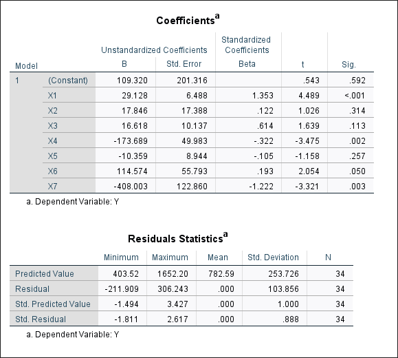

# Лабораторная работа №1

Выполнил: Матюхин Григорий Васильевич \
Студ. билет: 1032259322 \
Вариант: 11 \

## Тема: "Множественный регрессионный анализ"

### Цель работы

Приобрести практические навыки применения множественного регрессионного анализа
для решения конкретных задач с использованием статистического пакета SPSS.

### Выполнение работы

#### 1. Импортировать данные из файла в формате Excel в файл SPSS

{witdh=100 height=100}
{witdh=200 height=200}

#### 2. Построить матрицу парной корреляции всех переменных и, проанализировав ее, сделать выводы относительно связи зависимой переменной от факторов и о связи между факторами

{witdh=200 height=200}

#### 3. Используя метод исключения, построить уравнение линейной множественной регрессии

{witdh=200 height=200}
{witdh=200 height=200}

#### 4. Оценить качество модели с помощью коэффициента детерминации и провести проверку значимости на основе критерия Фишера

См. "Выводы".

### Выводы

1.  Анализ матрицы коэффициентов парной корреляции показывает,
    что зависимая переменная ($Y$) имеет связь с $X1$ ($r_{y,x_1}=0.749$).
    Также видна сильная связь $X1$ с $X3$, $X7$ ($0.894$, $0.917$ соответственно)
    а также $X3$ с $X7$ ($0.959$)

2.  Коэффициент детерминации $R^2 = 0.856$ модели,
    следовательно около $86\%$ вариации зависимой перменной учтено в модели
    и обусловлено влиянием включенных факторов.

3.  Значение критерия Фишера составляет $F = 22.169$,
    а значимость уравнения регрессии -- $Sig. < 0.001$.
    Уравнение регрессии следует признать _адекватным_, модель считается _значимой_.
