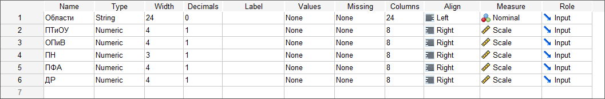
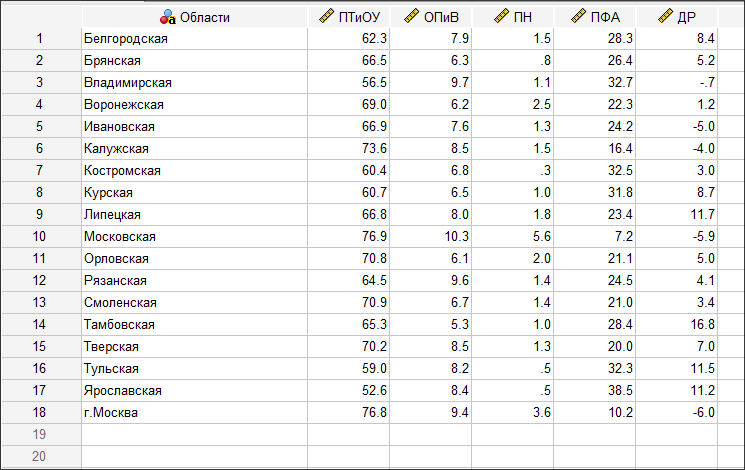
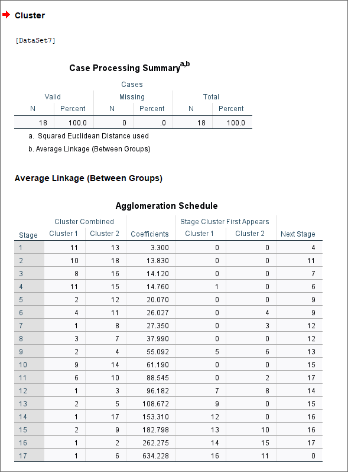
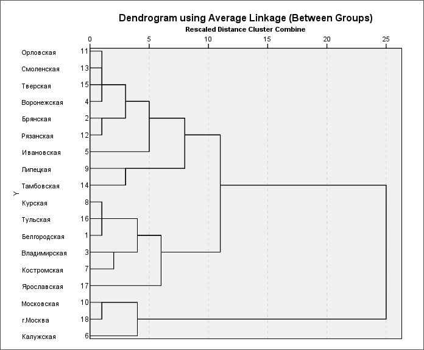
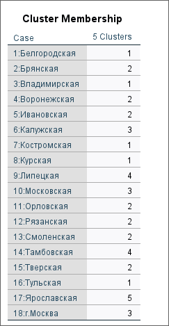
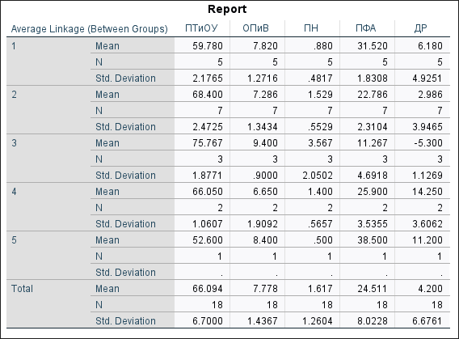
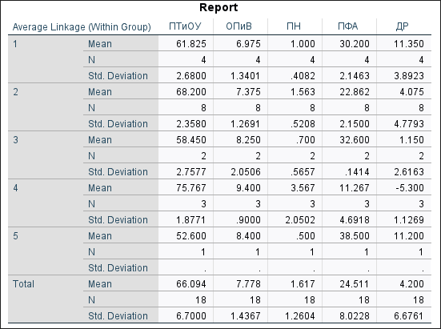

# Лабораторная работа №2

Выполнил: Матюхин Григорий Васильевич \
Студ. билет: 1032259322 \
Вариант: 1 \

## Тема: "Кластерный анализ"

### Цель работы

Приобрести практические навыки применения кластерного анализа
для решения конкретных задач с использованием статистического пакета SPSS.

### Выполнение работы

#### 1. Импортировать данные из файла в формате Excel в файл SPSS

{witdh=100 height=100}
{witdh=200 height=200}

#### 2. Определить оптимальное количество кластеров для разбиения регионов но однородные группы по всем группировачным признакам одновременно

Проведем предварительный классификацию иерархическим методом и посмотрим на порядок агломерации, чтобы определить оптимальное количество кластеров.

{witdh=200 height=200}

Оптимальным будет количество кластеров равное разниче между количеством наблюдений (18)
и шагом агломерации, после котороо коэффициент увеличивается скачкообразно.
В таблице видно несколько мест где увеличение коэффициента можно назвать скачкообразным:

- после шага 7: скачок от 27.350 до 37.990
- после шага 8: скачок от 37.990 до 55.092
- после шага 10: скачок от 61.190 до 88.545
- после шага 12: скачок от 96.182 до 108.672
- после шага 16: скачок от 262.275 до 634.228

Скачек после шага 16 является наиболее значимым, но он даст нам только два кластера.
В ходе выполнения работы мною было принято решение опираться на скачок после шага 12.
Тогда количество кластеров -- 5.

#### 3. Провести классификацию областей иерархическим методом с алгоритмом межгрупповых связей и отобразить результаты в виде дендрограммы

Проведем повторный анализ, с заданым количеством кластеров,
используя алгоритм межгрупповых связей.

{witdh=200 height=200}
{witdh=200 height=200}

#### 4. Проанализировать основные приоритеты денежных расходов и сбережений в полученных кластерах

{width=200 height=200}

- Кластер 1 (5 регионов):
  Преобладают сбережения и инвестиции (прирост финансовых активов -- 31.5%, выше среднего) и базовое потребление (покупка товаров и оплата услуг -- 59.8%). Низкие показатели по инвестициям в недвижимое имущество (приобретение недвижимости -- 0.9%) и дополнительным расходам (прочие расходы -- 6.2%). Ориентация на долгосрочную финансовую стабильность.
- Кластер 2 (7 регионов):
  Доминирует базовое потребление (покупка товаров и оплата услуг -- 68.4%, выше среднего), с умеренными сбережениями и инвестициями (прирост финансовых активов -- 22.8%). Низкие значения по инвестициям в недвижимое имущество (приобретение недвижимости -- 1.5%) и дополнительным расходам (прочие расходы -- 3.0%). Фокус на удовлетворении текущих потребностей.
- Кластер 3 (3 региона):
  Повышенное базовое потребление (покупка товаров и оплата услуг -- 75.8%), минимальные сбережения и инвестиции (прирост финансовых активов -- 11.3%). Более высокие показатели по инвестициям в недвижимое имущество (приобретение недвижимости -- 3.6%), отрицательное значение дополнительных расходов (прочие расходы -- -5.3%), что указывает на прирост наличности. Акцент на немедленные расходы и ликвидные активы.
- Кластер 4 (2 региона):
  Сбалансированное распределение между базовым потреблением (покупка товаров и оплата услуг -- 66.1%) и сбережениями и инвестициями (прирост финансовых активов -- 25.9%). Низкие показатели по инвестициям в недвижимое имущество (приобретение недвижимости -- 1.4%), высокое значение дополнительных расходов (прочие расходы -- 14.3%). Умеренная стратегия с корректировкой наличности.
- Кластер 5 (1 регион):
  Максимальные сбережения и инвестиции (прирост финансовых активов -- 38.5%), сниженное базовое потребление (покупка товаров и оплата услуг -- 52.6%). Минимальные показатели по инвестициям в недвижимое имущество (приобретение недвижимости -- 0.5%), высокое значение дополнительных расходов (прочие расходы -- 11.2%). Стратегия накопления.

#### 5. Сравнить полученную классификацию с результатами применения алгоритма внутригрупповых связей

{width=200 height=200}

- Структура кластеров:
  Межгрупповые связи -- распределение 5/7/3/2/1 регионов.
  Внутригрупповые связи -- распределение 4/8/2/3/1 регионов
  (перераспределение регионов для большей внутригрупповой однородности).
- Общие средние
  Полностью идентичны (покупка товаров и оплата услуг -- 66.1%; прирост финансовых активов -- 24.5%; обязательные платежи -- 7.8%; приобретение недвижимости -- 1.6%; прочие расходы -- 4.2%).
- Ключевые различия в профилях кластеров
  Межгрупповые связи: больше разнообразия --
  два потребительских кластера (высокое потребление, низкие сбережения),
  два сберегательных и один умеренный.
  Внутригрупповые связи: кластеры однороднее, преобладают сберегательные профили
  (три кластера с приростом активов 30–38%),
  только один ярко потребительский (потребление 75.8%, сбережения 11.3%).
- Вариабельность
  Внутригрупповые связи показывают меньший разброс внутри кластеров (более сплочённые группы).

### Выводы

Алгоритм межгрупповых связей лучше выделяет межгрупповые различия и
выявляет больше потребительски ориентированных регионов.
Алгоритм внутригрупповых связей усиливает внутригрупповую однородность,
формируя преимущественно накопительный взгляд на данные.
Таким образом, выбор алгоритма существенно влияет на понимание
региональных моделей расходов и накоплений.
