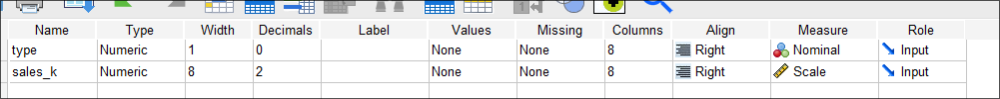
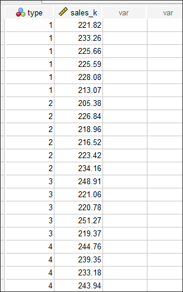
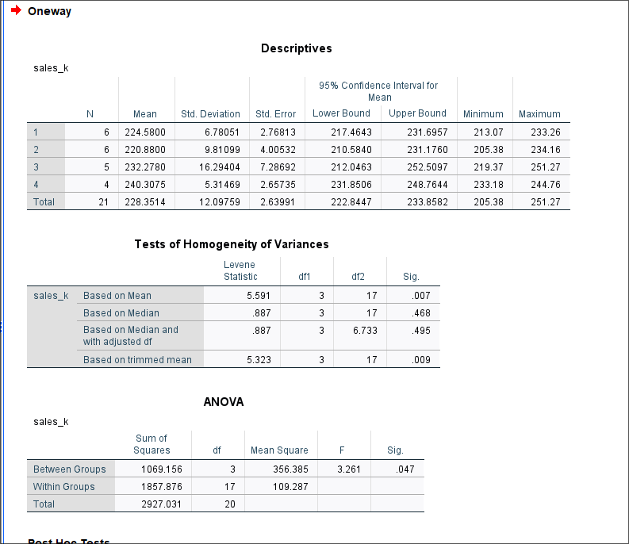
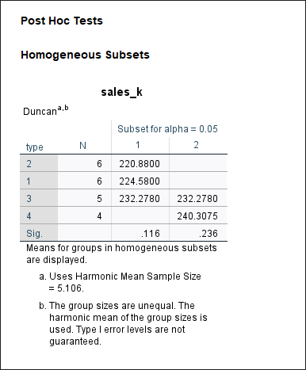

# Лабораторная работа №3

Выполнил: Матюхин Григорий Васильевич \
Студ. билет: 1032259322 \
Вариант: 11 \

## Тема: "Дисперсионный анализ"

### Цель работы

Приобрести практические навыки применения дисперсионного анализа
для решения конкретных задач с использованием статистического пакета SPSS.

### Выполнение работы

#### 1. Импортировать данные из файла в формате Excel в файл SPSS

{witdh=100 height=100}
{witdh=200 height=200}

#### 2. Проведем однофакторый дисперсионный анализ

{witdh=200 height=200}
{witdh=200 height=200}

Критерий однородности Ливиня для моих данных представлен в четырех вариантах:

- Среднее
- Усеченное среднее
- Медиана
- Медиана с скорректированными степенями свободы

Их можно разделить на две группы: базирующиеся на среднем показывают,
что различия между дисперсиями значимые,
в то время как базирующиеся на медиане -- что различия незначимые.
Для выполнения данной работы воспользуемся значениями основанными на медиане,
т.к. она меньше подвержена влиянию выбросов, экстремальных значений или
скошеных распределений по сравнению со средним.

В данном случае, $Sig. = 0.468 >> 0.05$ указывает что между дисперсиями для средних
объемов продажы при разных типах рекламы -- незначительна.

В таблице ANOVA приведены результаты однофакторного дисперсионного анализа.
$Sig. = 0.047$ показывает, что различия между средними объемами продажы товара
для четырех типов рекламы статистичеки достоверны.

В таблице Homogenous Subsets представлены разлиция по среднему объему продаж.
Видно что типы рекламы 1 и 2 (A и B) составляют одну группу а 3 и 4 (C и D) -- другую.
Тип рекламы 3 (C) может быть отнесен к обоим группам.

### Выводы

Возвращаясь к условиям задачи, можно сделать вывод,
что средний объем продаж при использовании разных типов рекламы существенно различается.
