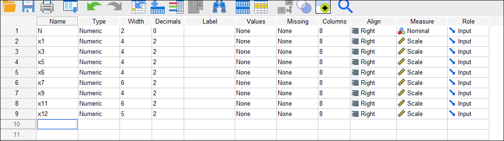
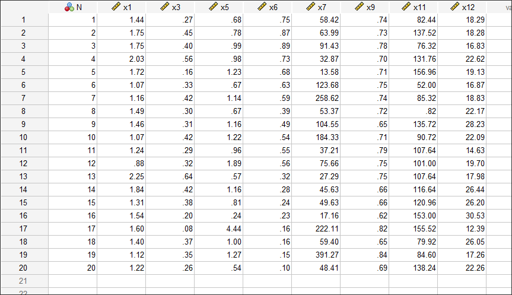
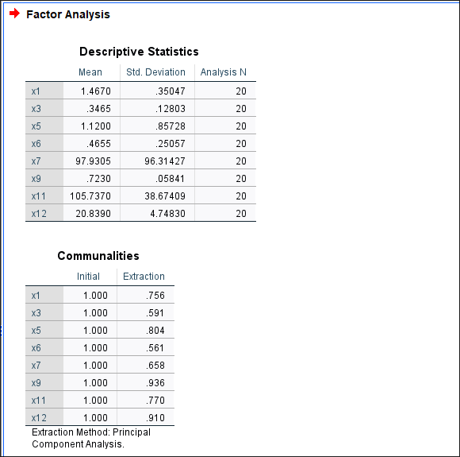
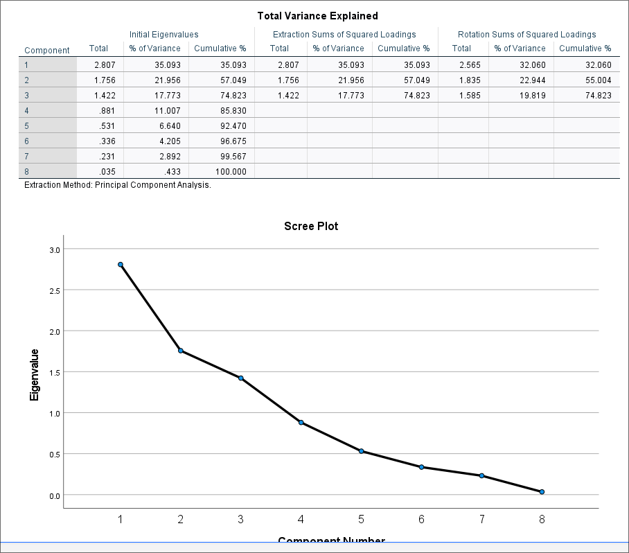
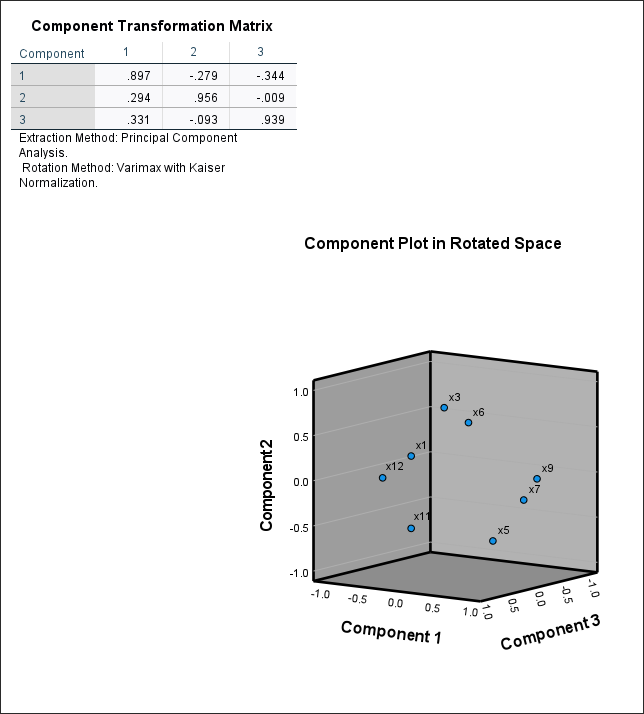
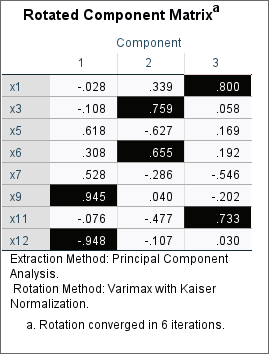

# Лабораторная работа №4

Выполнил: Матюхин Григорий Васильевич \
Студ. билет: 1032259322 \
Вариант: 1 \

## Тема: "Факторный анализ"

### Цель работы

Приобрести практические навыки применения факторного анализа
для решения конкретных задач с использованием статистического пакета SPSS.

### Выполнение работы

#### 1. Импортировать данные из файла в формате Excel в файл SPSS

{witdh=100 height=100}
{witdh=200 height=200}

#### 2. Провести факторный анализ

{witdh=200 height=200}
{witdh=200 height=200}
{witdh=200 height=200}
{witdh=200 height=200}

Из таблицы Total Variance Explained видно,
что только три фактора имеют собственные значения,
суммарно объясняющие 74.823% совокупной дисперсии.

{witdh=200 height=200}

Найдем наибольшие факторные нагрузки в таблице Related Component Matrix (отмечены черным на изображении выше).

Фактору 1 (Эффективность коммерческой деятельности) соответствуют:

- уровень реализуемой продукции
- непроизводственные доходы

Фактору 2 (Материальная эффективность) соответствуют:

- удельный вес закупочных материалов в общих расходах
- удельный вес потерь от брака

Фактору 3 (Эффективность использования активов) соответствуют:

- уровень фондоотдачи
- оборачиваемость оборотных средств

### Выводы

Чтобы оптимизировать **Эффективность коммерческой деятельности** необходимо
увеличить объем реализованной продукции через расширение рынков сбыта, улучшение маркетинга и продаж;
диверсифицировать и повысить непроизводственные доходы (например, от инвестиций, аренды или побочной деятельности).

Чтобы оптимизировать **Материальную эффективность** необходимо
снизить удельный вес закупочных материалов в расходах путем поиска дешевых поставщиков,
переговоров о ценах и оптимизации закупок;
минимизировать потери от брака через улучшение контроля качества,
обучение персонала и модернизацию производства.

Чтобы оптимизировать **Эффективность использования активов** необходимо
повысить фондоотдачу за счет интенсивного использования основных средств,
модернизации оборудования и сокращения простоев;
ускорить оборачиваемость оборотных средств путем оптимизации запасов,
сокращения дебиторской задолженности и ускорения цикла продаж.

#### Рейтинг предприятий

В таблице ниже представены наиболее преспективные предприятия:

| FAC1 | FAC2 | FAC3 |
| ---- | ---- | ---- |
| 17   | 13   | 4    |
| 19   | 3    | 5    |
| 3    | 4    | 13   |
| 11   | 2    | 17   |
| 7    | 8    | 2    |
